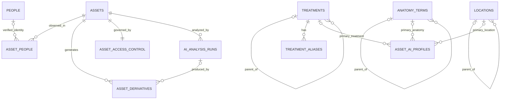

# Job 2 Core ER Diagram

`asset_people.person_id` is nullable: known verified people may link to `people`; anonymous patients remain unlinked while retaining non-identity observations.

Controlled parents use RESTRICT. Canonical references use SET NULL. Asset-owned operational metadata uses CASCADE only when its canonical asset is deliberately deleted.

