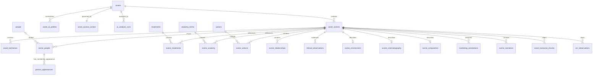

# Job 3 ER diagram

```mermaid
erDiagram
  assets ||--o{ asset_scenes : contains
  assets ||--o{ asset_ai_profiles : summarizes
  assets ||--|| asset_access_control : governed_by
  assets ||--o{ ai_analysis_runs : analyzed_by
  asset_scenes ||--o{ asset_keyframes : contains
  asset_scenes ||--o{ scene_people : shows
  people o|--o{ scene_people : verifies
  scene_people ||--o{ person_appearances : has_nonidentity_appearance
  asset_scenes ||--o{ scene_treatments : references
  treatments ||--o{ scene_treatments : controls
  asset_scenes ||--o{ scene_anatomy : references
  anatomy_terms ||--o{ scene_anatomy : controls
  asset_scenes ||--o{ scene_actions : contains
  actions ||--o{ scene_actions : controls
  asset_scenes ||--o{ scene_relationships : contains
  asset_scenes ||--o{ clinical_observations : evidences
  asset_scenes ||--o| scene_environment : describes
  asset_scenes ||--o| scene_cinematography : describes
  asset_scenes ||--o| scene_composition : describes
  asset_scenes ||--o{ marketing_annotations : interprets
  asset_scenes ||--o{ scene_narratives : narrates
  asset_scenes ||--o{ asset_transcript_chunks : aligns
  asset_scenes ||--o{ ocr_observations : aligns
```
