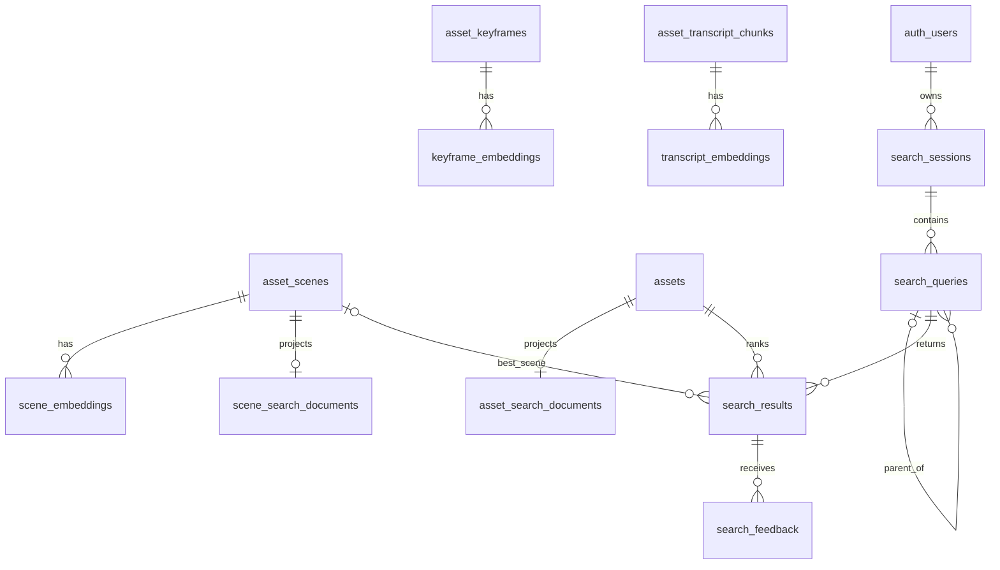

# Job 4 search ER diagram

```mermaid
erDiagram
  asset_scenes ||--o{ scene_embeddings : has
  asset_keyframes ||--o{ keyframe_embeddings : has
  asset_transcript_chunks ||--o{ transcript_embeddings : has
  assets ||--o| asset_search_documents : projects
  asset_scenes ||--o| scene_search_documents : projects
  auth_users ||--o{ search_sessions : owns
  search_sessions ||--o{ search_queries : contains
  search_queries o|--o{ search_queries : parent_of
  search_queries ||--o{ search_results : returns
  assets ||--o{ search_results : ranks
  asset_scenes o|--o{ search_results : best_scene
  search_results ||--o{ search_feedback : receives
```
